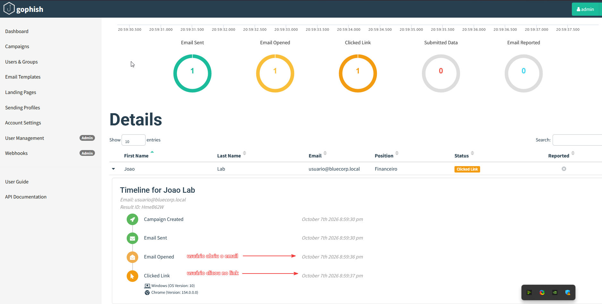
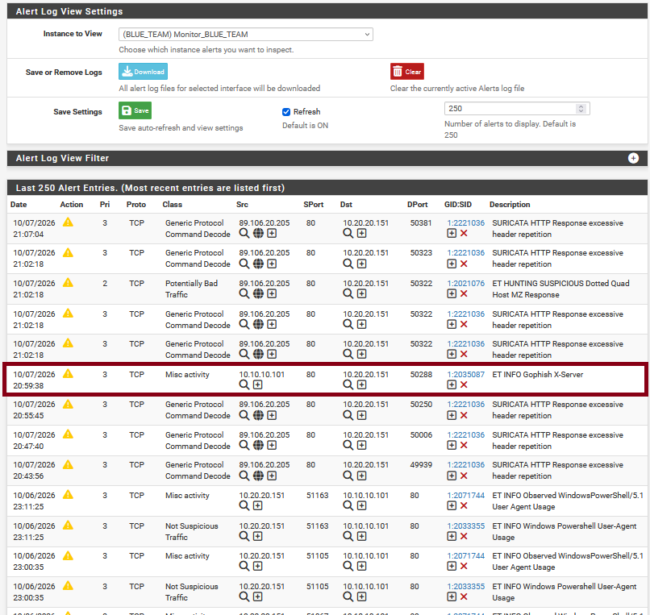

# PhishingLab — Investigação SOC de Phishing

Laboratório prático de **SOC / Blue Team** criado para simular uma campanha de phishing e investigar a atividade utilizando múltiplas fontes de telemetria.

O projeto correlaciona evidências de **GoPhish**, **Sysmon**, **Splunk** e **Suricata** para reconstruir o fluxo de um incidente de phishing em ambiente controlado.

---

## Objetivo

O objetivo deste laboratório foi desenvolver uma investigação ponta a ponta, cobrindo:

- criação e execução de uma campanha de phishing simulada;
- registro de abertura de e-mail e clique em link;
- coleta de telemetria no endpoint Windows;
- ingestão e análise dos eventos no Splunk;
- monitoramento e detecção na camada de rede com Suricata;
- correlação temporal entre diferentes fontes;
- documentação técnica da investigação;
- mapeamento MITRE ATT&CK;
- troubleshooting real de coleta e forwarding de logs.

---

## Tecnologias utilizadas

| Tecnologia | Função no laboratório |
|---|---|
| GoPhish | Simulação da campanha de phishing |
| Mailpit | Servidor SMTP e visualização dos e-mails de teste |
| Windows 10 | Endpoint vítima |
| Microsoft Edge | Navegador utilizado na interação com a campanha |
| Sysmon | Telemetria de endpoint e conexões de rede |
| Splunk Universal Forwarder | Envio dos eventos do Windows |
| Splunk Enterprise | SIEM para centralização e investigação |
| pfSense | Roteamento e segmentação das redes do laboratório |
| Suricata | IDS e monitoramento de rede |
| VirtualBox | Ambiente de virtualização |

---

## Arquitetura resumida

```text
                         ┌─────────────────────────┐
                         │   Phishing Server       │
                         │     Ubuntu Server       │
                         │     10.10.10.101        │
                         │                         │
                         │  GoPhish     TCP/80     │
                         │  Mailpit     TCP/8025   │
                         │              SMTP/1025  │
                         └────────────┬────────────┘
                                      │
                                      │ HTTP / SMTP
                                      │
                         ┌────────────▼────────────┐
                         │        pfSense          │
                         │       Suricata          │
                         │     IDS / Network       │
                         │      Monitoring         │
                         └────────────┬────────────┘
                                      │
                            BLUE TEAM NETWORK
                              10.20.20.0/24
                                      │
                    ┌─────────────────┴─────────────────┐
                    │                                   │
          ┌─────────▼─────────┐              ┌──────────▼─────────┐
          │    Windows 10     │              │ Splunk Enterprise  │
          │   Victim Host     │              │    SIEM Server     │
          │   10.20.20.151    │              │    10.20.20.102    │
          │                   │              │                    │
          │ Microsoft Edge    │   TCP/9997   │ Search & Analysis  │
          │ Sysmon            ├─────────────►│                    │
          │ Splunk Forwarder  │              └────────────────────┘
          └───────────────────┘
```

Documentação completa da topologia: [arquitetura.md](arquitetura.md)

---

## Fluxo do incidente

```text
GoPhish
   │
   ├── Email Sent
   ├── Email Opened
   └── Clicked Link
          │
          ▼
Windows 10 / Microsoft Edge
          │
          ├── Mailpit :8025
          └── GoPhish :80
                    │
                    ▼
              Sysmon Event ID 3
                    │
                    ▼
                  Splunk

Em paralelo:

Windows 10 ───── HTTP/TCP ───── GoPhish
                    │
                    ▼
                 Suricata
                    │
                    ▼
        ET INFO Gophish X-Server
```

---

## Evidências principais

### 1. Timeline da campanha no GoPhish

A campanha registrou:

- `Campaign Created`
- `Email Sent`
- `Email Opened`
- `Clicked Link`



---

### 2. Ingestão do Sysmon no Splunk

O endpoint Windows enviou eventos do canal:

```text
Microsoft-Windows-Sysmon/Operational
```

O principal evento utilizado na investigação foi:

```text
Event ID 3 - Network connection detected
```


---

### 3. Correlação das conexões no Splunk

A análise identificou o processo:

```text
C:\Program Files (x86)\Microsoft\Edge\Application\msedge.exe
```

comunicando-se com:

```text
10.10.10.101:8025  → Mailpit
10.10.10.101:80    → GoPhish Landing Page
```


---

### 4. Detecção de rede no Suricata

O Suricata registrou o alerta:

```text
ET INFO Gophish X-Server
```

confirmando tráfego HTTP associado ao servidor GoPhish.



---

## Busca SPL principal

A consulta utilizada para correlacionar as conexões do endpoint com a infraestrutura de phishing foi:

```spl
index=main host="Windows10"
source="WinEventLog:Microsoft-Windows-Sysmon/Operational"
EventCode=3
DestinationIp="10.10.10.101"
| table _time Image User SourceIp SourcePort DestinationIp DestinationPort Protocol
| sort _time
```

Todas as consultas utilizadas estão documentadas em:

[splunk/searches.md](splunk/searches.md)

---

## Resultado da investigação

A atividade foi classificada como:

```text
True Positive - laboratório controlado
```

Principais indicadores observados:

| Campo | Valor |
|---|---|
| Host | `Windows10` |
| Source IP | `10.20.20.151` |
| Destination IP | `10.10.10.101` |
| Destination Port | `80` |
| Processo | `msedge.exe` |
| Sysmon Event ID | `3` |
| Suricata Alert | `ET INFO Gophish X-Server` |

---

## MITRE ATT&CK

### Técnicas principais

| Tática | Técnica | ID |
|---|---|---|
| Initial Access | Phishing: Spearphishing Link | `T1566.002` |
| Execution | User Execution: Malicious Link | `T1204.001` |

### Técnica relacionada à comunicação observada

| Tática | Técnica | ID |
|---|---|---|
| Command and Control / comunicação associada | Application Layer Protocol: Web Protocols | `T1071.001` |

> `T1071.001` foi utilizado somente como referência à comunicação HTTP observada. O laboratório não simulou uma infraestrutura completa de Command and Control nem execução de payload pós-clique.

Mapeamento completo: [mitre-mapping.md](mitre-mapping.md)

---

## Troubleshooting realizado

Um dos principais desafios do projeto foi identificar por que os eventos do Sysmon não apareciam no Splunk.

O serviço estava executando como:

```text
NT SERVICE\SplunkForwarder
```

O canal do Sysmon exigia permissão adequada para leitura. A solução foi adicionar a conta do serviço ao grupo local:

```text
Leitores de log de eventos
```

Após reiniciar o serviço, os eventos passaram a ser ingeridos corretamente.

Também foram validados:

- serviço `SplunkForwarder`;
- receiver TCP `9997`;
- `Test-NetConnection`;
- `btool inputs list --debug`;
- `splunkd.log`;
- source e sourcetype no Splunk;
- sincronização e diferenças de timestamp entre as ferramentas.

Detalhes completos: [lesson-learned.md](lesson-learned.md)

---

## Estrutura do repositório

```text
PhishingLab/
│
├── README.md
├── arquitetura.md
├── investigation.md
├── detection-analysis.md
├── mitre-mapping.md
├── lesson-learned.md
│
├── splunk/
│   ├── inputs.conf
│   └── searches.md
│
└── screenshots/
    ├── 01-gophish-timeline.png
    ├── 02-splunk-sysmon-ingestion.png
    ├── 03-splunk-event-timeline.png
    ├── 04-suricata-gophish-alerta.png
    ├── 05-captura-windows-event-gophish-landing-page.png
    ├── 06-captura-windows-event-mailpit.png
    └── 07-splunk-sysmon-ingestion.png
```

---

## Documentação

- [Arquitetura do laboratório](arquitetura.md)
- [Investigação do incidente](investigation.md)
- [Análise de detecção](detection-analysis.md)
- [Mapeamento MITRE ATT&CK](mitre-mapping.md)
- [Lições aprendidas](lesson-learned.md)
- [Configuração do Splunk Universal Forwarder](splunk/inputs.conf)
- [Buscas SPL utilizadas](splunk/searches.md)

---

## Principais aprendizados

Este laboratório permitiu praticar:

- análise de phishing;
- investigação orientada por evidências;
- Sysmon Event ID 3;
- Splunk SPL;
- troubleshooting de Universal Forwarder;
- permissões de serviço no Windows;
- monitoramento de rede com Suricata;
- correlação entre endpoint e rede;
- reconstrução de timeline;
- MITRE ATT&CK;
- documentação técnica de incidentes.

---

## Escopo e ética

Todo o laboratório foi executado em ambiente isolado e controlado, utilizando máquinas virtuais, contas fictícias e infraestrutura própria para fins educacionais e de desenvolvimento profissional em **Cybersecurity / Blue Team / SOC**.

Nenhum sistema de terceiros foi alvo deste projeto.

---

## Autor

**João Rovani**  
Cybersecurity | Blue Team | SOC Analyst | Detecção e Resposta a Incidentes

GitHub: [Rovani-Sec](https://github.com/Rovani-Sec)
