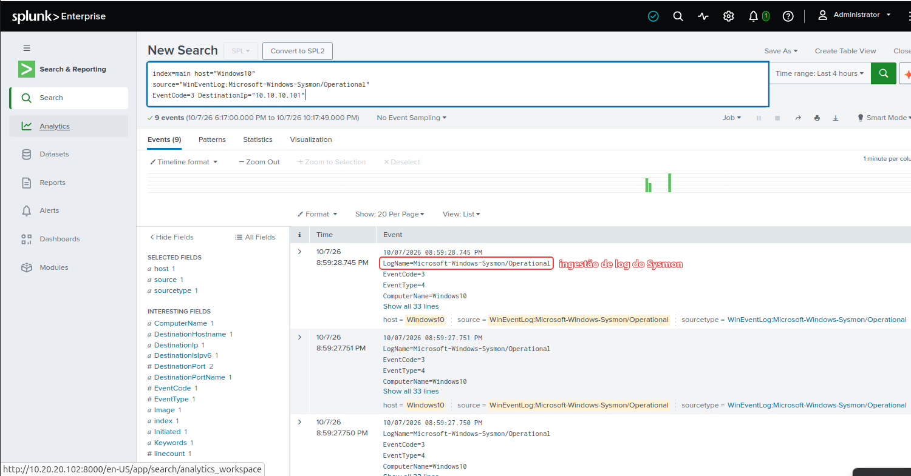
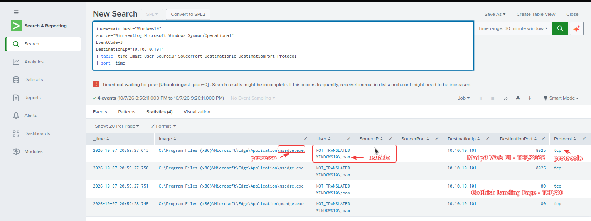

# Análise de Detecção

## 1. Objetivo

Este documento descreve as etapas utilizadas para detectar e validar a atividade relacionada à campanha simulada de phishing.

A detecção foi construída a partir da correlação entre três fontes principais:

- **GoPhish** — registro da interação do usuário;
- **Sysmon + Splunk** — telemetria do endpoint;
- **Suricata** — visibilidade e detecção de rede.

O objetivo foi verificar se o clique registrado na campanha poderia ser confirmado tecnicamente no endpoint e na rede.

---

## 2. Fonte 1 — GoPhish

O GoPhish foi utilizado como fonte inicial de contexto da campanha.

A timeline registrou:

| Evento | Horário |
|---|---:|
| Campaign Created | 20:59:30 |
| Email Sent | 20:59:30 |
| Email Opened | 20:59:36 |
| Clicked Link | 20:59:37 |

O evento **Clicked Link** foi utilizado como ponto de partida para a investigação nas demais fontes.


---

## 3. Fonte 2 — Sysmon

No endpoint Windows 10 foi utilizado o **Sysmon** para registrar conexões de rede.

O principal evento analisado foi:

```text
Event ID 3 - Network connection detected
```

Esse evento permite observar informações como:

- processo responsável pela conexão;
- usuário;
- IP de origem;
- IP de destino;
- porta de origem;
- porta de destino;
- protocolo.

Durante o laboratório foram observadas conexões do processo:

```text
C:\Program Files (x86)\Microsoft\Edge\Application\msedge.exe
```

para o servidor:

```text
10.10.10.101
```

nas portas:

```text
8025 - Mailpit Web UI
80   - GoPhish Landing Page
```

---

## 4. Ingestão no Splunk

Os eventos do Sysmon foram enviados ao Splunk por meio do **Splunk Universal Forwarder**.

A fonte utilizada foi:

```text
WinEventLog:Microsoft-Windows-Sysmon/Operational
```

O host identificado no Splunk foi:

```text
Windows10
```

A evidência abaixo confirma a ingestão dos eventos do Sysmon pelo SIEM.



---

## 5. Busca inicial no Splunk

A primeira consulta utilizada para identificar conexões de rede do endpoint foi:

```spl
index=main host="Windows10"
source="WinEventLog:Microsoft-Windows-Sysmon/Operational"
EventCode=3
```

Depois, a busca foi refinada para o IP do servidor de phishing:

```spl
index=main host="Windows10"
source="WinEventLog:Microsoft-Windows-Sysmon/Operational"
EventCode=3
DestinationIp="10.10.10.101"
```

---

## 6. Identificação do acesso à infraestrutura de phishing

Para organizar os campos relevantes foi utilizada a consulta:

```spl
index=main host="Windows10"
source="WinEventLog:Microsoft-Windows-Sysmon/Operational"
EventCode=3
DestinationIp="10.10.10.101"
| table _time Image User SourceIp SourcePort DestinationIp DestinationPort Protocol
| sort _time
```

A análise mostrou o Microsoft Edge estabelecendo conexões com:

```text
10.10.10.101:8025
10.10.10.101:80
```

A porta `8025` corresponde à interface web do Mailpit, enquanto a porta `80` corresponde ao acesso ao servidor GoPhish.



---

## 7. Detecção na camada de rede — Suricata

O Suricata foi utilizado para monitorar o tráfego entre o endpoint e o servidor de phishing.

Durante a investigação foi identificado o alerta:

```text
ET INFO Gophish X-Server
```

A evidência observada foi:

```text
Source:      10.10.10.101:80
Destination: 10.20.20.151:50288
Protocol:    TCP
Time:        20:59:38
```

Esse alerta confirma a existência de tráfego HTTP associado ao servidor GoPhish.


---

## 8. Correlação das detecções

As três fontes apresentaram evidências relacionadas ao mesmo fluxo de atividade:

| Fonte | Evidência | Resultado |
|---|---|---|
| GoPhish | `Clicked Link` | Usuário interagiu com o link |
| Sysmon | Event ID 3 | Processo do navegador estabeleceu conexão |
| Splunk | Consulta por `DestinationIp=10.10.10.101` | Evento centralizado e investigável |
| Suricata | `ET INFO Gophish X-Server` | Comunicação confirmada na rede |

A correlação permitiu validar que a atividade não estava presente apenas no console da ferramenta de phishing, mas também produziu telemetria real no endpoint e na rede.

---

## 9. Resultado da detecção

A atividade foi classificada como:

```text
True Positive - laboratório controlado
```

Indicadores principais observados:

```text
Host: Windows10
Source IP: 10.20.20.151
Destination IP: 10.10.10.101
Destination Port: 80
Process: msedge.exe
Sysmon Event ID: 3
Suricata Alert: ET INFO Gophish X-Server
```

---

## 10. Observações de melhoria

Em um ambiente corporativo real, a lógica poderia ser evoluída para incluir:

- criação de alertas automáticos no SIEM;
- enriquecimento do IP ou domínio de destino;
- correlação entre proxy, DNS, endpoint e e-mail;
- identificação de múltiplos usuários acessando a mesma infraestrutura;
- integração com regras de detecção baseadas em MITRE ATT&CK;
- resposta automatizada ou abertura de incidente para triagem SOC.

Este laboratório teve como foco principal a compreensão do fluxo de detecção, investigação e correlação manual das evidências.
